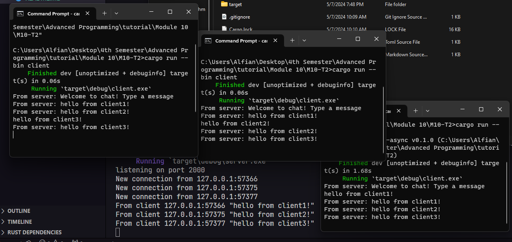

# Reflection

### [2.1]

To run the program, 
1. launch the server so it can connect and listen on port 2000. (using `cargo run --bin server`)
2. launch the client using `cargo run --bin client` in a new terminal

After the connecting the client, the server will recognized the new connections. Each client can send messages, which the server then shares with all connected clients. Thus, after sending messages, each client receives the messages from the server.