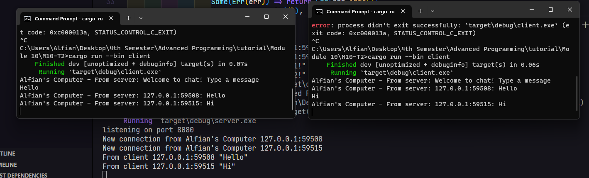

# Reflection

### [2.1] How it runs

To run the program, 
1. launch the server so it can connect and listen on port 2000. (using `cargo run --bin server`)
2. launch the client using `cargo run --bin client` in a new terminal

After the connecting the client, the server will recognized the new connections. Each client can send messages, which the server then shares with all connected clients. Thus, after sending messages, each client receives the messages from the server.

### [2.2] Modifying port
Changes made in `client.rs`:
```rust
ClientBuilder::from_uri(Uri::from_static("ws://127.0.0.1:8080"))
```

Changes made in `server.rs`:
```rust
let listener = TcpListener::bind("127.0.0.1:8080").await?;
println!("listening on port 8080");
```

From what I understand, they use the same package called tokio_websockets to set up websocket connections. So, they should also be using the same protocol.

### [2.3] 

changes were made in:
```rust
// server.rs (16)
.send(Message::text("Alfian's Computer - From server: Welcome to chat! Type a message".to_string()))

// server.rs (30)
bcast_tx.send(format!("Alfian's Computer - From server: {}: {}", addr, text).into())?;
```
I change the string directly at the send point because it is straightforward and efficient. I also did this to minimize the potential errors in other parts of the code.